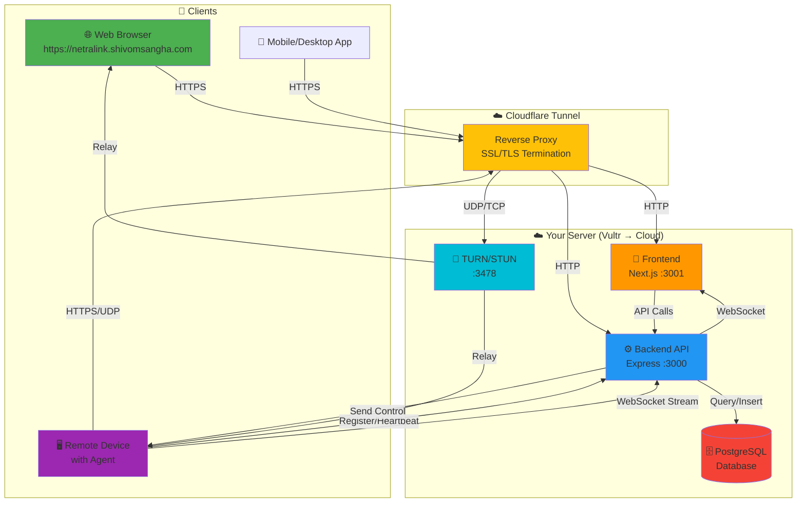
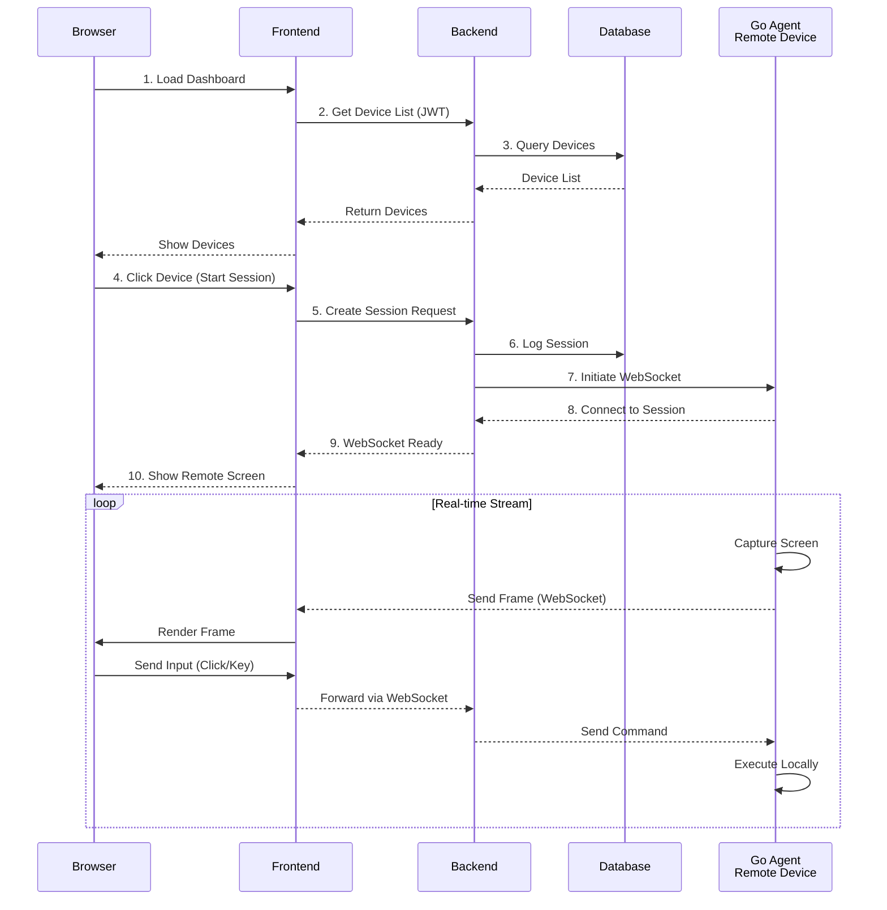
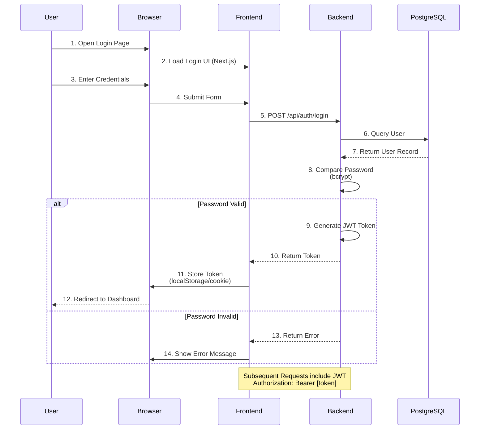
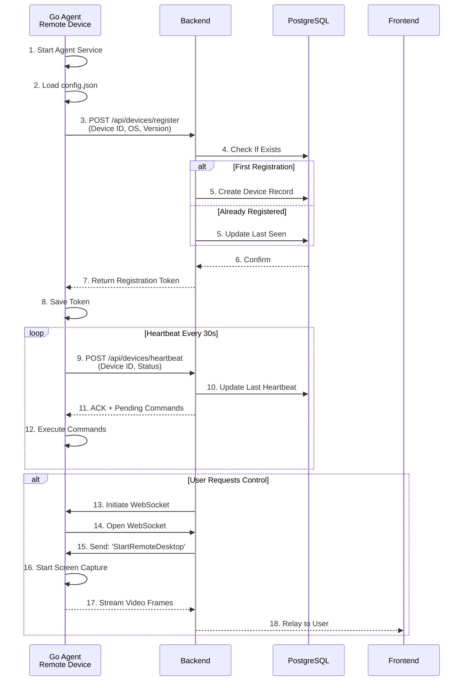
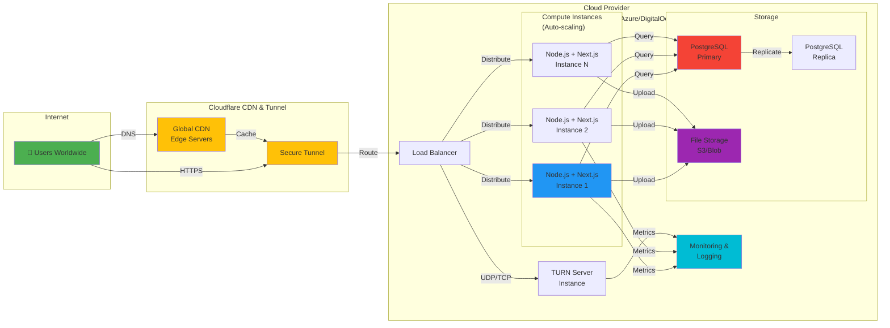
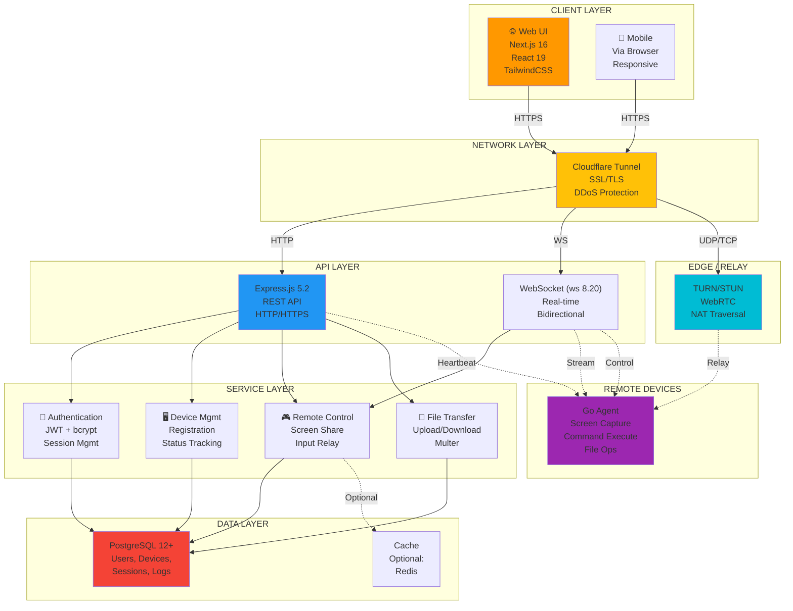
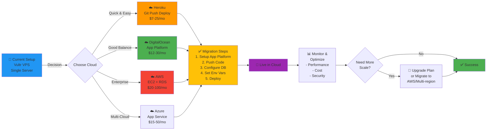

# Visual Architecture Diagrams

## Component Interaction Diagram

---

## Data Flow: Remote Desktop Session

---

## Authentication Flow

---

## Go Agent Registration & Communication

---

## Deployment Architecture

---

## Technology Stack Overview

---

## Cloud Migration Path

---

## File Structure & Module Organization

```mermaid
graph TB
    root["remote-control/"]
    
    root --> agent["📁 agent/<br/>Go Application"]
    agent --> a1["main.go"]
    agent --> a2["config.go"]
    agent --> a3["register.go"]
    agent --> a4["heartbeat.go"]
    agent --> a5["remote_desktop.go"]
    agent --> a6["file_transfer.go"]
    agent --> a7["executor.go"]
    agent --> a8["ws.go<br/>(WebSocket)"]
    agent --> amod["go.mod<br/>go.sum"]
    
    root --> server["📁 server/<br/>Node.js Backend"]
    server --> src["src/"]
    src --> s1["index.ts<br/>(Entry)"]
    src --> s2["routes/"]
    src --> s3["controllers/"]
    src --> s4["middleware/"]
    src --> s5["utils/"]
    server --> spkg["package.json"]
    server --> senv[".env"]
    
    root --> web["📁 web/<br/>Next.js Frontend"]
    web --> app["app/"]
    web --> pub["public/"]
    web --> wpkg["package.json"]
    web --> wenv[".env.production"]
    
    root --> shared["📁 shared/<br/>Common Code"]
    shared --> types["types/"]
    shared --> utils["utils/"]
    shared --> const["constants/"]
    
    root --> docs["📁 docs/"]
    docs --> readme["README.md"]
    docs --> arch["ARCHITECTURE.md"]
    docs --> deps["DEPENDENCIES.md"]
    
    root --> scripts["📁 scripts/"]
    scripts --> deploy["deploy.sh"]
    scripts --> backup["backup.sh"]
    
    style root fill:#f0f0f0
    style agent fill:#9C27B0
    style server fill:#2196F3
    style web fill:#FF9800
    style docs fill:#4CAF50
```

