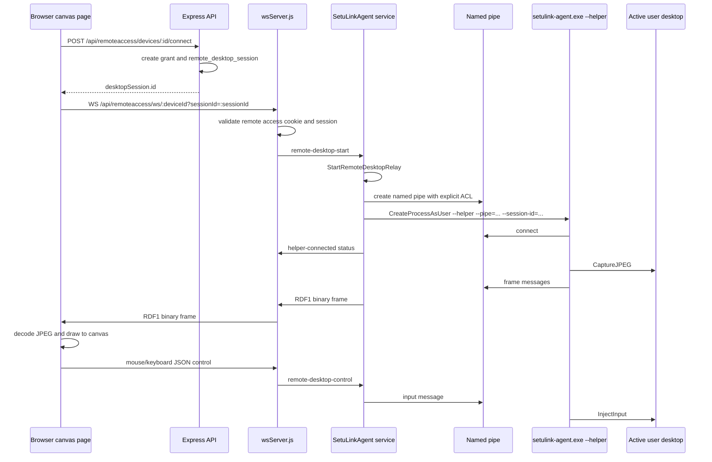
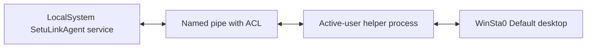

# Remote Desktop Relay

## Current Intended Path

Remote desktop should use the WebSocket relay path:

```text
/api/remoteaccess/ws/DEVICE_ID?sessionId=SESSION_ID
```

It should not depend on WebRTC, STUN, or TURN for the current JPEG relay path.

## End-to-End Flow



## Frame Format

Agent to server to browser binary payload:

```text
RDF1
uint32 big-endian JSON header length
JSON header
JPEG bytes
```

The browser viewer parses this in:

```text
web/app/remoteaccess/devices/[id]/desktop/page.tsx
```

The server relays it in:

```text
server/src/wsServer.js
```

The agent encodes it in:

```text
agent/remote_desktop_relay.go
```

## Expected Logs

On a successful service-mode Connect attempt, agent logs should include:

```text
remote-desktop-relay-start
relay-start
helper-launch-path
helper-launched
helper-start
helper-pipe-connected
helper-connected
```

Useful PowerShell check:

```powershell
Select-String -Path "C:\ProgramData\SetuLink\logs\agent.log" -Pattern 'remote-desktop-relay-start|relay-start|helper-launch|helper-launched|helper-start|helper-pipe-connected|helper-connected|helper-pipe-connect-failed|did not connect|helper exited' |
  Select-Object -Last 60
```

## Windows Service Boundary

The Windows service runs as LocalSystem. The helper runs in the active interactive user session. The named pipe is the bridge.



The pipe ACL is declared in `agent/desktop_pipe_windows.go`:

```text
D:P(A;;GA;;;SY)(A;;GA;;;BA)(A;;GA;;;IU)(A;;GA;;;AU)
```

## Failure Meaning

```text
desktop helper did not connect to pipe: context deadline exceeded
```

This means:

- The browser reached the backend.
- The backend reached the agent over WebSocket.
- The agent started the relay runtime.
- The service waited for the helper pipe connection.
- The helper did not connect before timeout.

Most likely areas after that error:

- Helper process was not launched.
- Helper launched in the wrong session.
- Helper started but could not dial the pipe.
- Helper started but blocked before pipe dial.
- Installed service binary is not the expected freshly built binary.

## Legacy WebRTC State

Some older API/session handlers and tests still model offer/answer/ICE records because they existed before the relay path. The active browser viewer uses the WebSocket relay and canvas page, not a WebRTC video element.

The important guardrail is that connect/session creation should not auto-start the old WebRTC runtime. The relay starts when the browser opens:

```text
/api/remoteaccess/ws/DEVICE_ID?sessionId=SESSION_ID
```

