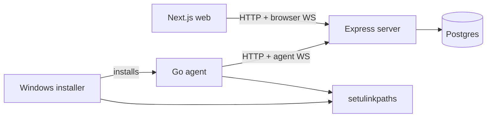

# Repository Graph

## Git Snapshot

Current local branch:

```text
master
```

Current commit graph:

```text
* 42f8a60 (HEAD -> master) Initial commit: Remote control application
```

The repository currently has one committed baseline plus many active working-tree changes. Before a release, review `git status --short` and split the work into clear commits.

## Top-Level Layout

```text
remote-control/
  agent/                    Go Windows/Linux agent
  server/                   Node/Express API and WebSocket relay
  web/                      Next.js operator and remote-access UI
  installer/SetuLinkSetup/  Windows installer, bootstrap, packaging
  shared/setulinkpaths/     Shared Go runtime path layout helper
  scripts/                  Deploy, health-check, restart helpers
  docs/                     Runbooks, testing notes, architecture docs
```

## Code Ownership Map

```mermaid
flowchart TD
  Repo[remote-control repo]

  Repo --> Agent[agent/ Go service]
  Repo --> Server[server/ Express API]
  Repo --> Web[web/ Next.js UI]
  Repo --> Installer[installer/SetuLinkSetup]
  Repo --> Shared[shared/setulinkpaths]
  Repo --> Scripts[scripts/]
  Repo --> Docs[docs/]

  Agent --> AgentCore[main loop, heartbeat, commands, files]
  Agent --> AgentService[Windows service wrapper]
  Agent --> AgentDesktop[remote desktop relay + helper]
  Agent --> AgentRecovery[health, watchdog, recovery, upgrade]

  Server --> ApiRoutes[REST API routes]
  Server --> WsRelay[wsServer.js WebSocket relay]
  Server --> Db[Postgres schema/models]
  Server --> Access[auth, remote access, audit]

  Web --> AdminUI[admin/device dashboard]
  Web --> RemoteUI[remote access portal]
  Web --> DesktopUI[desktop canvas viewer]

  Installer --> SetupExe[installer.go bootstrap]
  Installer --> Inno[SetuLinkSetup.iss]
  Installer --> Build[build.ps1]

  Shared --> Paths[Windows/Linux runtime paths]
```



## Important Local Paths

| Area | Key files |
| --- | --- |
| Agent entry/service | `agent/main.go`, `agent/service_windows.go` |
| Agent WebSocket | `agent/ws.go` |
| Agent relay runtime | `agent/remote_desktop_relay.go`, `agent/desktop_pipe_windows.go` |
| Windows helper launch | `agent/session_launcher_windows.go`, `agent/helper_windows.go` |
| Capture/input | `agent/internal/remotedesktop/*` |
| Server entry | `server/src/index.js` |
| Server WebSocket relay | `server/src/wsServer.js` |
| Remote access API | `server/src/remoteAccess/handlers.js` |
| Remote desktop session state | `server/src/remoteDesktop/sessions.js`, `server/src/remoteDesktop/handlers.js` |
| Remote access detail UI | `web/app/remoteaccess/devices/[id]/page.tsx` |
| Canvas desktop viewer | `web/app/remoteaccess/devices/[id]/desktop/page.tsx` |
| Installer validation | `installer/SetuLinkSetup/src/installer.go`, `installer/SetuLinkSetup/src/installer_test.go` |

## Dependency Direction



The server is the coordination point. The browser never connects directly to the agent; the agent never exposes an inbound port for remote desktop.

