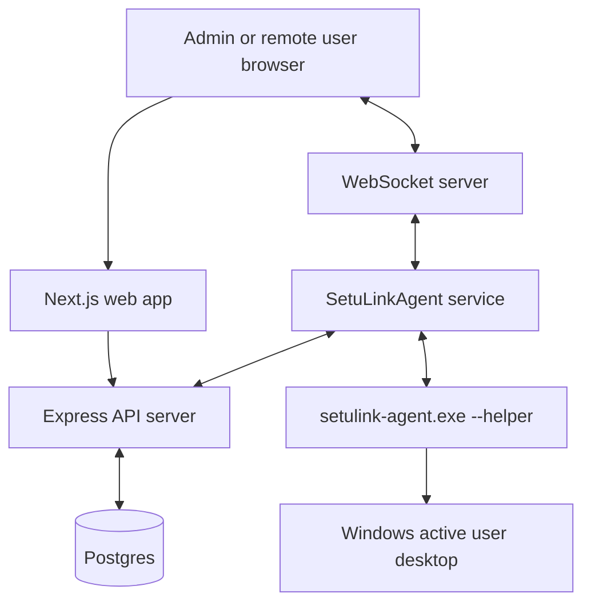
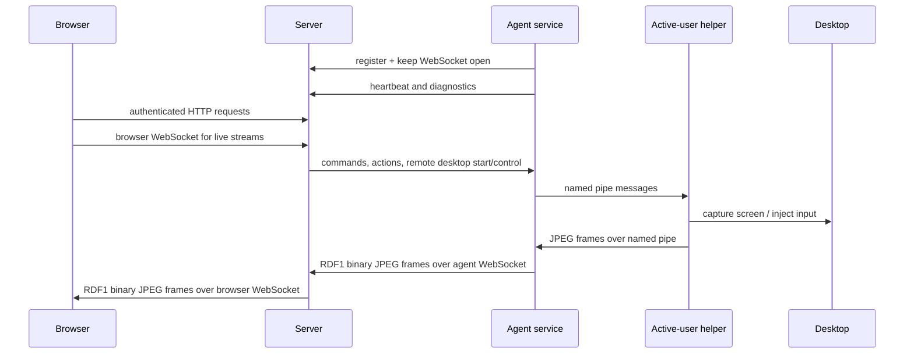
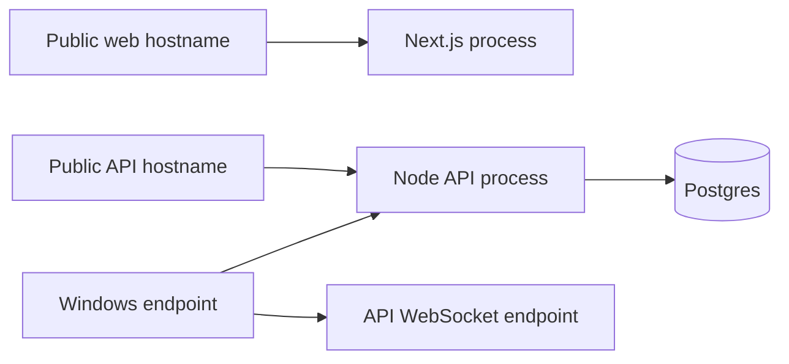

# System Architecture

## Purpose

The system provides unattended device management and remote access:

- Operators/admins use the web app for fleet health, commands, file transfer, upgrades, users, and diagnostics.
- Remote-access users authenticate separately and can open assigned devices.
- Installed agents maintain outbound connectivity to the backend.
- Remote desktop is relayed over backend WebSockets with JPEG frames, not direct browser-to-agent networking.

## Runtime Components



## Backend Responsibilities

The backend owns:

- Device registration, heartbeat, health summaries, and diagnostics.
- Admin authentication, remote-access authentication, sessions, and acknowledgement gates.
- Commands, file jobs, device actions, upgrade manifests, and audit events.
- Remote desktop session records and WebSocket relay pairing.
- Browser to agent command/control routing over WebSockets.

Key files:

- `server/src/index.js`
- `server/src/wsServer.js`
- `server/src/db/schema.js`
- `server/src/remoteAccess/*`
- `server/src/remoteDesktop/*`
- `server/src/admin/*`
- `server/src/diagnostics/*`
- `server/src/upgrades/*`

## Agent Responsibilities

The agent owns:

- Startup checks and runtime path preparation.
- Device registration and heartbeats.
- Command polling/execution and streaming command output over WebSocket.
- File transfers.
- Device actions and upgrade apply/rollback helpers.
- Diagnostics, watchdog state, and recovery policy.
- Remote desktop capture/input on the endpoint.

Key files:

- `agent/main.go`
- `agent/ws.go`
- `agent/heartbeat.go`
- `agent/actions.go`
- `agent/file_transfer.go`
- `agent/agent_diagnostics.go`
- `agent/agent_upgrade.go`
- `agent/internal/*`

## Windows Remote Desktop Split

Windows service mode crosses a user boundary:

```text
LocalSystem service
  -> launches helper in active user session
  -> helper captures desktop and injects input
```

The service and helper communicate through a named pipe. The pipe ACL allows:

```text
SYSTEM
Administrators
Interactive Users
Authenticated Users
```

This boundary is the most important Windows-specific part of the architecture.

## Data Flow Summary



## Deployment Shape



The Windows endpoint initiates outbound HTTP/WebSocket connections. Inbound device ports are not part of the intended design.

